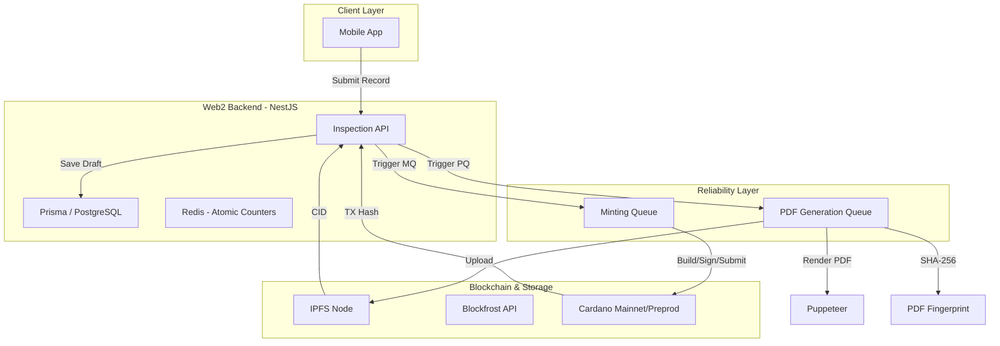

## Introduction

In the automotive second-hand market, trust is the primary currency. Buyers need to know if a vehicle has been accurately inspected, while inspectors need a way to prove their reports haven't been tampered with.

As part of **Sumbu Labs**, I worked as a Backend Developer to solve this problem for **PT. Inspeksi Mobil Jogja**. We built **CAR-dano**, a decentralized platform that turns vehicle inspection reports into immutable assets on the [Cardano](https://cardano.org) blockchain. This project was initiated by Giga and the PT Inspeksi team through a successful [Project Catalyst](https://projectcatalyst.io) Fund 13 proposal in late 2024.

Under the academic supervision of [Ir. Noor Akhmad Setiawan, S.T., M.T., Ph.D., IPM.](https://acadstaff.ugm.ac.id/nasetiawan) and [Guntur Dharma Putra, S.T., M.Sc., Ph.D.](https://gdputra.github.io), our team developed a robust bridge between traditional Web2 mobile applications and the Web3 ecosystem.


## The Engineering Challenge: Web2 Reliability meets Web3 Finality

Bringing blockchain to a real-world inspection business isn't just about writing smart contracts; it's about building a backend that survives the "chaos" of distributed systems. We faced three core engineering hurdles:

1.  **eUTXO State Management:** Unlike Account-based chains (like Ethereum), Cardano uses the **eUTXO (Extended Unspent Transaction Output)** model. We had to manage UTXO state manually to prevent "UTXO contention" when multiple transactions attempted to spend the same inputs or collateral simultaneously.
2.  **Strict Metadata Constraints:** On-chain metadata (CIP-25) is limited to **64 bytes** per string value. Truncating or splitting hashes without losing data integrity was a non-negotiable requirement.
3.  **Service Reliability:** The system depends on multiple external services (Blockfrost API, IPFS, and Puppeteer for PDF generation). A failure in any of these during a minting operation could result in data loss or "ghost" transactions.

---

## The System Architecture

Our backend was built with **NestJS**, chosen for its modularity and scalability. The database layer utilized **PostgreSQL** with **Prisma ORM** for operational data, while **Redis** handled atomic counters (for unique inspection IDs like `YOG-01052025-001`) and caching.



---

## Technical Implementation Deep-Dive

### 1. The Concurrency Guard: SimpleMutex & BIP-32

To prevent eUTXO collisions, I implemented a `SimpleMutex` in the `BlockchainService`. This ensures that for each internal wallet—managed using **BIP-32/CIP-0003** standards—transactions are built, signed, and submitted in a strict sequence.

### 2. The 64-Byte Metadata Puzzle

Cardano's metadata values cannot exceed 64 bytes. I developed a recursive sanitizer (pseudocode below) that optimizes URLs and ensures strict byte-limit compliance. Additionally, we prevented **Asset ID Collisions** by deriving Asset IDs from shortened hashes of the inspection data, ensuring uniqueness across the entire ledger.

### 3. Reliability through Queues & Circuit Breakers

We implemented custom `PdfGenerationQueue` and `BlockchainMintingQueue`. These queues use **exponential backoff** and **circuit breakers**. If Blockfrost or IPFS goes down, the system waits and retries without crashing the user's session, ensuring that every paid inspection eventually reaches the blockchain.

### 4. Smart Contracts with Aiken (Plutus V3)

We transitioned our validation logic to [Aiken](https://aiken-lang.org), a modern functional language for Cardano. Our smart contract (`inspection_policy.mint`) ensures that only authorized admin wallets can mint NFTs and that each NFT is uniquely tied to a specific inspection event.

The system uses the **Aiken Blueprint** (`plutus.json`), which represents the source code translated into Plutus Core. This allows the backend to work with the validator's hash without requiring the full source code at runtime.

---

## Under the Hood: The Algorithms

To ensure the logic is clear for researchers and other engineers, here are the core algorithms used in the CAR-dano backend.

### 1. Initialization Logic

The service initializes connection providers and the wallet using environment-specific keys.

```text
ALGORITHM InitializeBlockchainService:
    1. READ 'BLOCKFROST_ENV' (preview/preprod/mainnet)
    2. INITIALIZE BlockfrostProvider with API Key
    3. INITIALIZE MeshWallet using Secret Key (ROOT/Bech32)
    4. ATTACH Blockfrost as both Fetcher and Submitter to the Wallet
    5. SET minUtxoLovelace (default: 2,000,000 lovelace / 2 ADA)
```

### 2. Metadata Sanitizer (The 64-byte Guard)

Cardano metadata values cannot exceed 64 bytes. The service recursively cleans all data.

```text
ALGORITHM SanitizeMetadata:
    INPUT data: ANY
    
    IF data is STRING:
        IF byteLength(data) > 64:
            IF data is IPFS URL:
                REPLACE "https://ipfs.io/ipfs/" WITH "ipfs://"
            IF length STILL > 64:
                TRUNCATE to 64 bytes
    ELSE IF data is OBJECT or ARRAY:
        RECURSIVELY apply SanitizeMetadata to all children
    RETURN cleaned data
```

### 3. Core Minting Algorithm

This is the logic executed inside our `BlockchainMintingQueue` to ensure every transaction is finalized correctly.

```text
ALGORITHM MintInspectionNFT:
    INPUT metadata: InspectionNftMetadata
    
    1. ACQUIRE Mutex lock for the backend wallet address
    2. SANITIZE metadata (ensure 64-byte string limits)
    3. CALCULATE policyId using ForgeScript
    4. BUILD Transaction Payload:
        - Mint 1 token with policyId and assetName
        - Attach CIP-25 Metadata under label '721'
        - Select optimal UTXOs for fees
    5. SIGN and SUBMIT via Blockfrost
    6. IF Submission fails (e.g., Stale UTXO):
        - REBUILD with fresh UTXO selection
        - RETRY with Exponential Backoff
    7. RELEASE Mutex lock
```

### 4. The Aiken Minting Flow

Unlike standard minting, the Aiken integration uses **UTXO-stapling** for advanced security.

```text
ALGORITHM BuildAikenMintTx:
    1. FETCH Admin's UTXOs from Blockfrost
    2. SELECT 'Reference UTXO' to parameterize the policy
    3. PARAMETERIZE Aiken Script with Reference UTXO hash
    4. CONSTRUCT Redeemer (Aiken 'v3' redeemer)
    5. BUILD Unsigned Transaction using PlutusScriptV3
    6. RETURN CBOR to be signed by the Authorized Admin
```

---

## The Data Integrity Lifecycle

1.  **Submission**: Inspector uploads data from the field.
2.  **PDF Generation**: **Puppeteer** renders a high-fidelity report.
3.  **Hashing**: We calculate the **SHA-256 fingerprint** of the PDF. This hash serves as the "Fingerprint" of the record.
4.  **IPFS Pinning**: The PDF is stored permanently on IPFS, returning a CID.
5.  **Metadata Mapping**: The PDF hash and CID are mapped to a **CIP-25** NFT metadata object.
6.  **Cardano Minting**: Using the [MeshJS SDK](https://meshjs.dev), we build a transaction that mints a unique NFT on Cardano.
7.  **Immutability**: Once the transaction is confirmed on the Cardano blockchain, the record is **immutable**. Any attempt to alter the PDF would result in a hash mismatch, and the NFT serves as the permanent certificate of authenticity.

---

## The Team Behind Sumbu Labs

This project was a true collaborative effort by the **Sumbu Labs** team:
- **Giga Hidjrika Aura Adkhy** (Project Manager/Initiator)
- **Dzikran Azka Sajidan** (Mobile Developer)
- **Farhan Franaka** (Frontend Developer)
- **Maulana Anjari Anggorokasih** (Backend Developer)
- **Azfar Azdi Arfakhsyad** (UI/UX Designer)

## Links & Resources

- **GitHub Organization**: [github.com/CAR-dano](https://github.com/CAR-dano)
- **Backend Repository**: [CAR-dano/cardano-backend](https://github.com/CAR-dano/cardano-backend)
- **Official Website**: [sumbu.xyz](https://sumbu.xyz)
- **Partner**: [inspeksimobil.id](https://inspeksimobil.id)

## Impact and Lessons Learned

Integrating Web2 standards with Web3 finality taught me that **reliability is the hardest part of blockchain engineering**. By building a system that handles state management and service failure gracefully, we provided **PT. Inspeksi Mobil Jogja** with a truly tamper-proof digital archive. 

This project proves that the future of automotive trust isn't just in the engine—it's in the ledger.

---
*Learn more about our Project Catalyst proposal at [projectcatalyst.io](https://projectcatalyst.io).*
