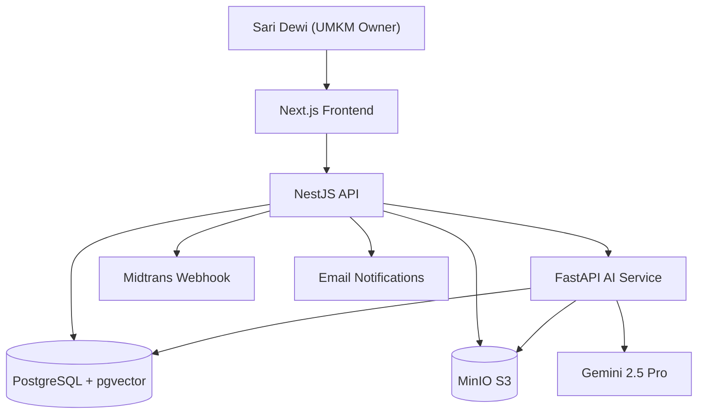

# Aksara AI — Legal Compliance Co-pilot for Indonesian MSMEs


## Repository

https://github.com/Sumbu-Labs/Aksara-Legal-AI

## Keywords

legal tech, compliance automation, Indonesian MSME, RAG, document generation, Gemini 2.5 Pro, pgvector, hackathon prototype, SaaS, regulatory technology

## Overview

Aksara Legal AI addresses the regulatory burden faced by Indonesian micro, small, and medium enterprises (MSMEs/UMKM). Navigating permits like PIRT (home industry food registration), Halal certification, and BPOM product registration requires deciphering dense legal jargon, managing paperwork across multiple government agencies, and often hiring expensive legal consultants (Rp 500k–1.5M per permit). Small business owners — our target persona is "Sari Dewi," founder of a growing kopi business in Sleman, DIY — cannot afford this overhead.


The platform delivers a functional prototype combining three services: a Next.js 15 frontend for onboarding and document management, a NestJS backend for business logic and persistence, and a Python FastAPI AI service running hybrid RAG (pgvector + BM25) over Indonesian regulatory documents, grounded in Gemini 2.5 Pro. The flagship feature, "Aksara Autopilot," generates draft permit applications from a user's business profile data.

This was built for the **National Vibe Coding** hackathon by a 3-person team under **Sumbu Labs**.

## My Role

I owned the **backend and system architecture** across all three services:

- **Backend API (NestJS):** Designed and implemented the full REST API — authentication (JWT + demo bypass), business profile CRUD, document upload with MinIO presigned URLs, workspace orchestration endpoints, email notifications, and subscription management with Midtrans payment webhooks. Prisma ORM on PostgreSQL 17.
- **AI Service Architecture (FastAPI):** Designed the service boundary and integration contracts — hybrid RAG pipeline (pgvector embeddings + BM25 full-text search), Gemini 2.5 Pro client for grounded Q&A and Autopilot document generation, ingestion pipeline for regulatory PDFs/HTML, and template-based document rendering to HTML/PDF.
- **Infrastructure:** Docker Compose wiring for Postgres (with pgvector), MinIO S3 storage, and shared networking across all three services.
- **API Contracts:** Defined and documented the integration points between frontend, backend, and AI service, ensuring the team could work in parallel.

## Problem

Indonesian MSMEs face a **fragmented regulatory system**:

- Permit processes are spread across multiple agencies (Dinkes, BPOM, Halal bodies) with inconsistent documentation requirements
- Official guidelines are written in dense legal language with no plain-language summaries
- Administrative paperwork consumes dozens of hours per permit — form filling, document collection, format compliance
- Legal consultants cost Rp 500,000–1,500,000 per permit, unaffordable for most small businesses

The result: founders spend time on compliance paperwork instead of their products, and many operate without proper permits due to the friction.


## Solution

Aksara is a **3-tier SaaS prototype** connecting a Next.js UI to a NestJS backend and a Python AI microservice:

1. **Compliance Checklist Generator** — Business profile inputs (type, scale, location in DIY) produce a personalized permit roadmap
2. **Grounded Q&A Assistant** — Ask regulatory questions in Indonesian; the RAG pipeline retrieves relevant regulation chunks and Gemini 2.5 Pro generates answers with citations (or "Saya tidak dapat memverifikasi ini" when it cannot)

   

3. **Aksara Autopilot** — Upload supporting documents (KTP, NIB, etc.) and the AI pre-fills draft permit applications using JSON schema templates. Claims to cut 80% of administrative data entry
4. **Document Management** — MinIO S3 storage with versioning and presigned URL access

This is a hackathon prototype — the Autopilot generates drafts, not legally-binding documents. A real production version would require human-in-the-loop review, compliance certification, and direct government system integration.

## Architecture

```
┌─────────────┐     ┌─────────────┐     ┌──────────────┐
│  Frontend   │────▶│   Backend   │────▶│  AI Service  │
│  Next.js 15 │◀────│  NestJS 11  │◀────│  FastAPI     │
│  Port 7500  │     │  Port 7600  │     │  Port 7700   │
└─────────────┘     └─────────────┘     └──────────────┘
                           │                    │
                           ▼                    ▼
                     ┌─────────────┐     ┌──────────────┐
                     │  PostgreSQL │     │  Gemini 2.5  │
                     │  + pgvector │     │  Pro API     │
                     │  (embeddings)│    └──────────────┘
                     └─────────────┘
                           │
                           ▼
                     ┌─────────────┐
                     │    MinIO    │
                     │  (S3 docs)  │
                      └─────────────┘
```


**AI service internals** (hybrid RAG):

```
User Query → Embedding (text-embedding-004)
          → BM25 full-text search (regulatory DB)
          → Top-24 chunks → Rerank → Top-8
          → Gemini 2.5 Pro (grounded generation)
          → Response with citations
```

The Autopilot pipeline:

```
Business Profile + Uploaded Docs → Schema Template
  → Gemini 2.5 Pro resolves each field + audit trail
  → Jinja2 HTML rendering → WeasyPrint PDF export
```



## Hackathon Results

The project reached a **functional prototype** within the hackathon timeline with all three services deployed via Docker Compose, a working RAG pipeline over Indonesian regulatory content, and a 4-minute demo flow covering onboarding → compliance checklist → Q&A → Autopilot document generation. The 3-person team delivered this by splitting along clear service boundaries (frontend/business logic/AI), allowing parallel development with API contracts as the coordination mechanism.


## What's Next / Current Status

The prototype demonstrates the full user flow but has documented gaps for production:

- **No CI/CD** for backend or frontend (AI service has GitHub Actions only)
- **No background job queue** — all AI inference is synchronous blocking
- **No caching layer** — every request hits the LLM
- **Incomplete test coverage** — unit tests exist for AI service only
- **No API gateway** or rate limiting beyond basic FastAPI Redis integration
- **No monitoring, alerting, or staging environment**

A production path would require adding these, replacing demo bypass auth with proper IdP integration, adding human-in-the-loop review for Autopilot outputs, and working with government agencies for direct system integration.

## What I Learned

- **Time-boxed delivery:** With a 4-week hackathon window, choosing a synchronous RAG pipeline (no job queue, no streaming) was a deliberate trade-off for simplicity. It worked for the demo deadline but would need re-architecting for production.
- **API contracts as coordination tools:** Defining the NestJS↔FastAPI contract upfront let three developers work in parallel without blocking each other. Frontend never waited on AI service changes.
- **Docker Compose for team consistency:** One `docker-compose.yml` with Postgres, MinIO, and shared networking eliminated "works on my machine" problems across the team.
- **Hybrid RAG is worth the complexity:** Even in a hackathon prototype, combining vector search with BM25 keyword search handled out-of-vocabulary regulation terms (Indonesian legal abbreviations, article numbers) far better than embeddings alone.
- **What to cut:** No auth provider integration, no streaming responses, no proper error recovery — these were consciously deferred to hit the demo deadline.
